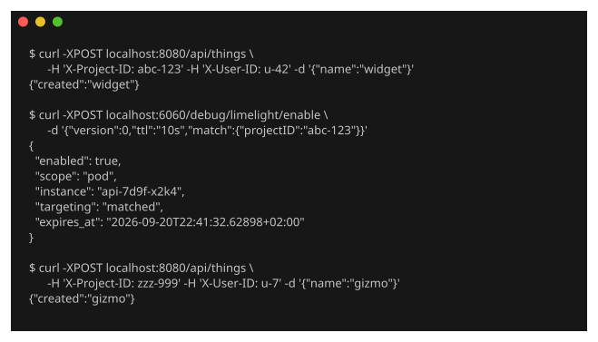
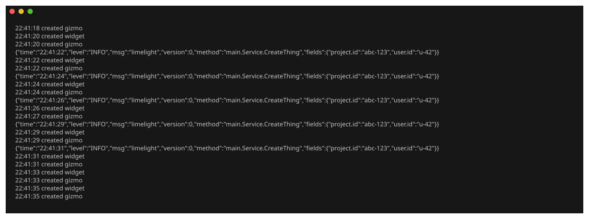

# limelight

**On-demand, identity-targeted method tracing for Go.**

> *"Trace everything for customer X for the next ten minutes."*

A customer reports a bug you cannot reproduce. Today you have two options: turn debug
logging on for everyone and pay for it, or ship a one-off log line and wait for a deploy.

limelight is the third one.

You (or your AI agent) flip the switch for one customer, and say for how long:



That service is serving two customers. Here is its log across the next twenty
seconds — untouched, and no restart anywhere in it:



Short lines are the service doing its job. The long ones are limelight, and only
for `abc-123` — `created gizmo` is the other customer, going through the same
tagged method, never emitting. Read the timestamps: the first event is `22:41:22`
and the last is `22:41:31`. That is the TTL closing itself. No deploy, no
cleanup, no flag left on.

## How

Tag the methods once, at compile time. The tag names a **registered extractor**, never a
raw context key — which is what lets it work in a codebase whose identity lives behind an
unexported type in some other package:

```go
limelight.Register("projectID", project.IDFromContext, limelight.As("project.id"))

//limelight:method fields:"projectID,userID"
func (s *Service) CreateThing(ctx context.Context, req Request) error {
```

Field names map onto OpenTelemetry semantic conventions — `user.id`, not `userID` — so
the output joins to the traces and logs you already have rather than becoming a third
place to look.

When the switch is off, a tagged call costs **~1.2 ns and zero allocations**: one atomic
load and a branch.

Compile-time method tagging is table stakes — otelc, orchestrion and go-instrument all do
it. **The targeted, expiring switch is the point.** It is not an APM, not a log shipper
and not a replacement for your tracer; it is a gate in front of the fields you already
wanted, that somebody can open for one customer and cannot forget to close.

## Try it

The tag takes effect through `-toolexec`, so an ordinary build applies it and no rewritten
source is ever left on disk.

```bash
git clone https://github.com/stuparm/limelight
cd limelight/examples/go-log

go build -o /tmp/limelight ../../limelight-go/cmd/limelight
go run -toolexec="/tmp/limelight toolexec" .
```

That is the service from the images above — a REST API on `:8080`, limelight's control
endpoint on `:6060`. In another shell:

```bash
# nothing is emitted
curl -sS -XPOST localhost:8080/api/things \
  -H 'X-Project-ID: abc-123' -H 'X-User-ID: u-42' -d '{"name":"widget"}'

# now trace that one project for thirty seconds
curl -sS -XPOST localhost:6060/debug/limelight/enable \
  -d '{"version":0,"ttl":"30s","match":{"projectID":"abc-123"}}'
```

Repeat the first call and the event appears. Repeat it with any other
`X-Project-ID` and nothing does. Thirty seconds later it stops on its own.

Then run it again as a plain `go run .`, with no shim. The service behaves identically
and emits nothing: without the tool in the build, `//limelight:method` is just a comment.

To wire it into your own service:

```bash
go install github.com/stuparm/limelight/limelight-go/cmd/limelight@latest
go build -toolexec="$(go env GOPATH)/bin/limelight toolexec" ./...
```

## Layout

| | |
|---|---|
| [`spec/`](spec/) | the wire contract every SDK shares — field contract, enable protocol, event schema |
| [`limelight-go/`](limelight-go/) | Go SDK: registry, switch, `-toolexec` shim, slog emitter. Stdlib-only, by construction — its `go.mod` has no `require` block |
| [`limelight-go/limelightzap/`](limelight-go/limelightzap/) | zap backend — its own module, so the dependency reaches only services that want it |
| [`limelight-go/limelightotel/`](limelight-go/limelightotel/) | OpenTelemetry: trace ids on every event, identity as span attributes, and force-sampling so a trace exists to write to |
| [`limelight-java/`](limelight-java/) | **planned.** A `pom.xml` and a package doc comment — no Java yet |
| [`examples/`](examples/) | runnable services — [`go-log`](examples/go-log/), [`go-log-zap`](examples/go-log-zap/) and [`go-otel`](examples/go-otel/) |
| [`docs/design.md`](docs/design.md) | why it is built this way, and the prior art |

The spec is written as its own thing, ahead of a second SDK, because context models
diverge per language while the field contract and the enable protocol do not. Today only
the Go SDK exists.

## Status

**The Go loop works end to end** — that is what the transcript at the top is.

Working: the registry and `As` mapping, the TTL-bounded switch, the `-toolexec` shim, the
enable/disable/status endpoint, emitters for `log/slog` and zap, and an OpenTelemetry
integration that puts `trace_id`/`span_id` on every event, the identity on the live span,
and force-samples the requests you targeted so there is a trace to write to.

Not built yet. The first two are why this is not v1 — both let a mistake pass in silence,
which is the one thing a tool like this cannot afford:

- the **`go vet` analyzer**. A directive is a comment, so nothing in the Go toolchain
  objects to a tag that cannot work — a method with no `context.Context`, or a `fields:`
  name nobody registered. Without the analyzer you find out in production, when you flip
  the switch during an incident and nothing comes out.
- the **tag ladder**. Only `//limelight:method` exists. Write `//limelight:type` and it is
  parsed as an ordinary comment and discarded without a word — a worse version of the same
  problem, since it looks like a supported feature.
- the **`methods` glob** in the enable protocol returns 501.
- **cross-service targeting**: the identity is evaluated per process, so a downstream
  service whose context never carried it stays silent. See the open question in
  [`docs/design.md`](docs/design.md).
- **limelight-java** — see above.

## License

Apache-2.0
